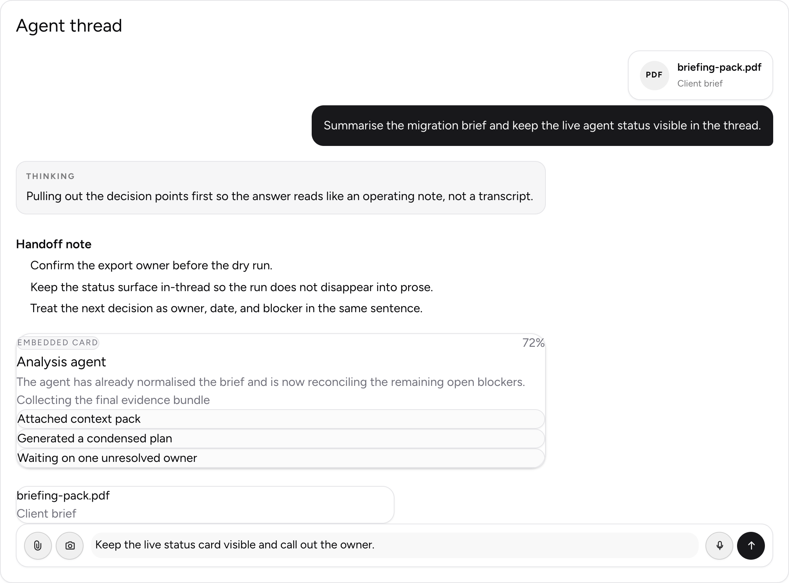
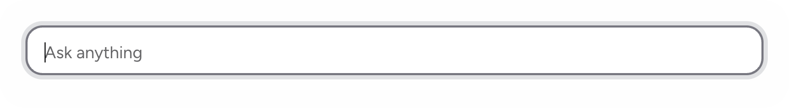
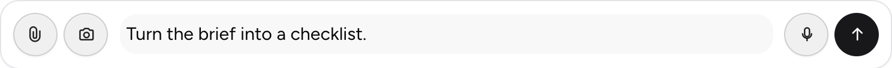
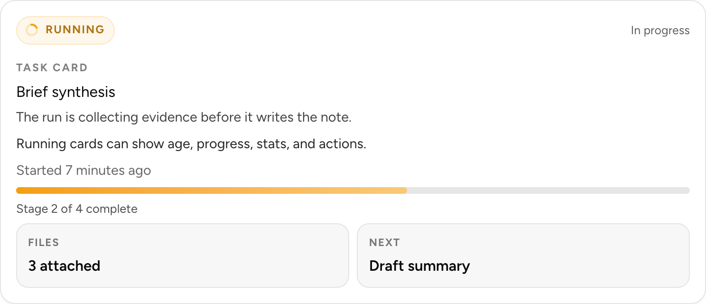

# @ljoukov/chat

[](https://www.npmjs.com/package/@ljoukov/chat)
[](https://github.com/ljoukov/chat/actions/workflows/ci.yml)
[](./LICENSE)

Composable Svelte 5 chat UI for assistant-style products.

`@ljoukov/chat` focuses on the rendering layer: thread layouts, markdown replies, autosizing inputs, richer composers, in-thread task cards, and extension points for app-specific embedded components.

## Screenshots









## Install

```sh
npm install @ljoukov/chat
```

The package ships as ESM and is designed for Svelte 5 projects.

## What You Get

- `ChatView` for the main thread shell
- `ChatMessage` for user, assistant, and system turns
- `ChatMarkdown` for markdown, tables, code blocks, and KaTeX
- `ChatTaskCard` for progress and status artifacts inside the thread
- `ChatInput` for autosizing text input
- `ChatComposer` for a richer input shell with action buttons
- typed helpers such as `textPart()`, `markdownPart()`, `taskPart()`, `thinkingPart()`, and `customPart()`

## Quick Start

```svelte
<script lang="ts">
	import {
		ChatComposer,
		ChatView,
		markdownPart,
		taskPart,
		textPart,
		type ChatMessageData
	} from '@ljoukov/chat';

	let draft = $state('');

	let messages = $state<ChatMessageData[]>([
		{
			id: 'welcome-user',
			role: 'user',
			parts: [textPart('Summarise this brief and keep the run status visible.')]
		},
		{
			id: 'welcome-assistant',
			role: 'assistant',
			parts: [
				taskPart({
					status: 'running',
					title: 'Brief synthesis',
					summary: 'Collecting evidence, then drafting the handoff note.',
					progress: { value: 58, label: 'Stage 2 of 4 complete' }
				}),
				markdownPart('The run card stays in the thread so status and narrative stay together.')
			]
		}
	]);
</script>

<ChatView
	title="Agent thread"
	description="Composable chat rendering with markdown and status cards."
	{messages}
>
	{#snippet composer()}
		<ChatComposer
			bind:value={draft}
			submitMode="enter"
			onSubmit={({ value }) => {
				messages = [
					...messages,
					{
						id: crypto.randomUUID(),
						role: 'user',
						parts: [textPart(value)]
					}
				];
				draft = '';
			}}
		/>
	{/snippet}
</ChatView>
```

## Custom Parts

Use `customPart()` when your app needs to embed richer UI inside an assistant turn without changing the library itself.

```svelte
<script lang="ts">
	import { ChatView, customPart, textPart, type ChatCustomPart } from '@ljoukov/chat';
	import AgentStatusCard from './AgentStatusCard.svelte';

	const messages = [
		{
			id: 'assistant-status',
			role: 'assistant',
			parts: [
				customPart('agent-status', {
					title: 'Analysis agent',
					progress: 72,
					stage: 'Collecting the final evidence bundle',
					summary: 'Reconciling the remaining open blockers.',
					updates: ['Attached context pack', 'Generated a condensed plan']
				})
			]
		},
		{
			id: 'assistant-copy',
			role: 'assistant',
			parts: [textPart('The custom card stays inside the same transcript flow as the rest of the reply.')]
		}
	];
</script>

<ChatView {messages}>
	{#snippet customPart(part: ChatCustomPart)}
		{#if part.key === 'agent-status'}
			<AgentStatusCard status={part.data as never} />
		{/if}
	{/snippet}
</ChatView>
```

## Message Model

`ChatView` consumes an array of `ChatMessageData`.

Each message contains:

- `role`: `user`, `assistant`, or `system`
- `attachments`: optional attachment metadata
- `parts`: an ordered list of content parts

Built-in parts:

- `text`
- `markdown`
- `thinking`
- `status`
- `task`
- `custom`

## API Notes

- Component APIs are typed with Svelte 5 `$props`.
- Composition uses snippet props rather than legacy slots where that keeps the surface cleaner.
- Interaction hooks use callback props instead of `createEventDispatcher`.
- The package does not depend on SvelteKit-only modules, so it can be consumed outside SvelteKit projects.
- `ChatTaskCard` is presentational. Adapt your own task or agent models into the exported `ChatTaskCardData` shape.

## Examples

The repository includes a SvelteKit demo app under [`examples/gallery`](examples/gallery) with:

- a structured demo app for the public components
- isolated `/render/*` routes for component-only visual examples
- a chat surface showing markdown, attachments, task cards, and embedded custom parts together

## License

[MIT](./LICENSE)
