# `@ljoukov/chat` [](https://www.npmjs.com/package/@ljoukov/chat) [](https://www.npmjs.com/package/@ljoukov/chat) [](https://github.com/ljoukov/chat/actions/workflows/ci.yml) [](./LICENSE) [](https://chat.ljoukov.workers.dev/)

Composable Svelte chat UI for assistant-style products: threaded transcripts, Spark-style composer shells, markdown replies, attachments, task cards, and custom in-thread parts.

Live gallery: [chat.ljoukov.workers.dev](https://chat.ljoukov.workers.dev/)

## What It Includes

- `ChatView`: top-level transcript surface with empty states, toolbar slot, composer slot, and custom-part rendering
- `ChatComposer`: Spark-style composer shell with stepped multiline growth, attachment previews, action menu, mic button, and submit states
- `ChatInput`: autosizing textarea for both standalone forms and chat shells
- `ChatMessage`: mapped message renderer for text, markdown, thinking, status, task cards, attachments, and custom parts
- `ChatTaskCard`: presentational run-state card for queued, running, ready, failed, or complete work
- `ChatMarkdown`: shared markdown renderer with KaTeX maths, syntax-highlighted code, and copy buttons for fenced code
- helper factories such as `textPart()`, `markdownPart()`, `thinkingPart()`, `statusPart()`, `taskPart()`, and `customPart()`

## Install

```sh
npm install @ljoukov/chat
```

The package ships as ESM and does not require any global stylesheet import.

## Quick Start

```svelte
<script lang="ts">
	import {
		ChatComposer,
		ChatView,
		markdownPart,
		taskPart,
		textPart,
		type ChatMessageData
	} from '@ljoukov/chat';

	let draft = $state('');

	let messages = $state<ChatMessageData[]>([
		{
			id: 'welcome-user',
			role: 'user',
			parts: [textPart('Summarise this brief and keep the run status visible.')]
		},
		{
			id: 'welcome-assistant',
			role: 'assistant',
			parts: [
				taskPart({
					status: 'running',
					title: 'Brief synthesis',
					summary: 'Collecting evidence, then drafting the handoff note.',
					progress: { value: 58, label: 'Stage 2 of 4 complete' }
				}),
				markdownPart('The run card stays in the thread so status and narrative stay together.')
			]
		}
	]);
</script>

<ChatView
	title="Agent thread"
	description="Composable chat rendering with markdown and status cards."
	{messages}
>
	{#snippet composer()}
		<ChatComposer
			bind:value={draft}
			submitMode="enter"
			onSubmit={({ value }) => {
				messages = [
					...messages,
					{
						id: crypto.randomUUID(),
						role: 'user',
						parts: [textPart(value)]
					}
				];
				draft = '';
			}}
		/>
	{/snippet}
</ChatView>
```

Use `customPart()` and the `customPart` snippet when your app needs to inject richer UI into an assistant turn without changing the library itself.

## Surface Catalog

The sections below show the exported chat surfaces, where they are implemented, what they are for, and the inputs they expect.

### ChatView

Implements: [`ChatView`](src/lib/components/ChatView.svelte)

Description: Top-level transcript shell with optional heading, toolbar, empty state, message list, composer slot, and custom-part rendering.

Required inputs

- none

Optional inputs

- `messages`
- `title`
- `description`
- `emptyTitle`
- `emptyDescription`
- `emptySuggestions`
- `toolbar`
- `composer`
- `customPart`
- `class`

<p>
  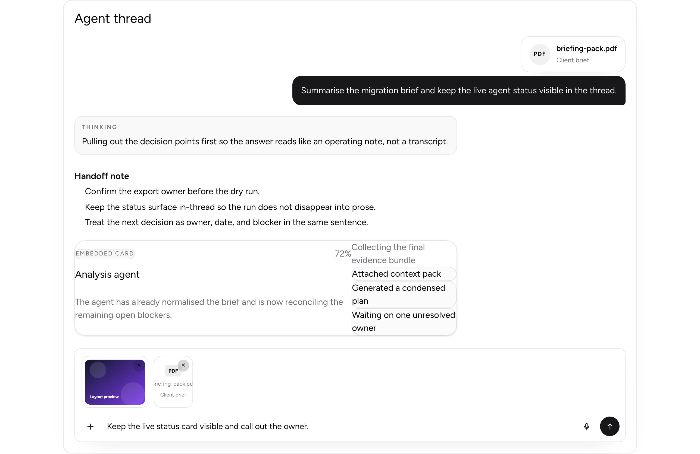
  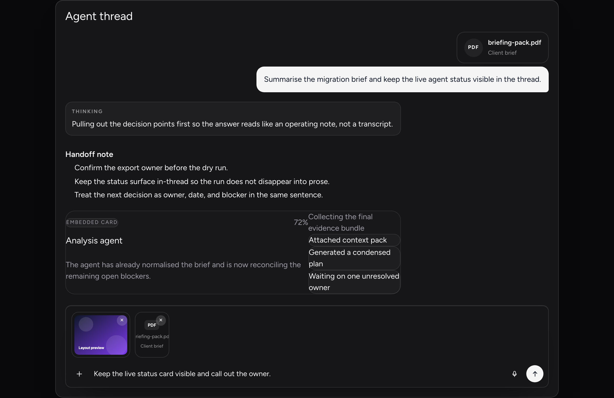
</p>

### ChatComposer

Implements: [`ChatComposer`](src/lib/components/ChatComposer.svelte)

Description: Spark-style composer shell with stepped multiline growth, draft-attachment previews, retry/remove affordances, action menu, mic button, and submit states.

Required inputs

- none

Optional inputs

- `value`
- `attachments`
- `attachmentError`
- `attachAction`
- `cameraAction`
- `micAction`
- `attachmentShortcutLabel`
- `submitMode`
- `submitReady`
- `placeholder`
- `showSubmitSpinner`
- `compactSubmitSpinner`
- `disabled`
- `maxLines`
- `maxChars`
- `onRemoveAttachment`
- `onRetryAttachment`
- `onInput`
- `onPaste`
- `onSubmit`
- `ariaLabel`
- `sendAriaLabel`
- `autocomplete`
- `spellcheck`
- `class`
- `inputClass`

<p>
  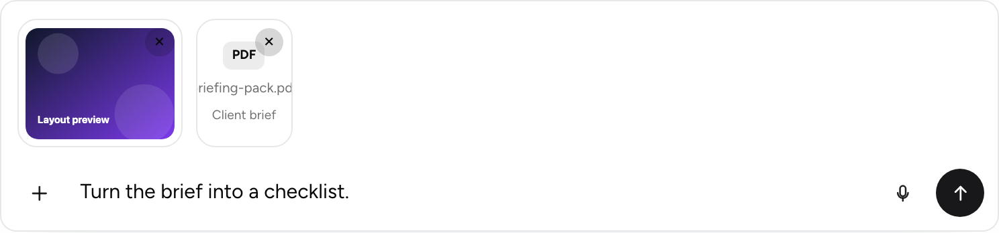
</p>
<p>
  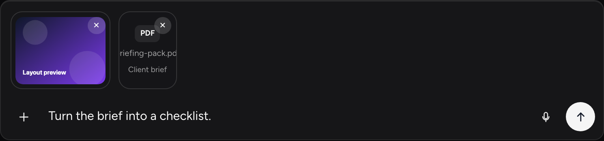
</p>

### ChatInput

Implements: [`ChatInput`](src/lib/components/ChatInput.svelte)

Description: Autosizing textarea primitive for both standalone form fields and inline chat composers.

Required inputs

- none

Optional inputs

- `value`
- `variant`
- `placeholder`
- `submitMode`
- `disabled`
- `maxLines`
- `maxChars`
- `onInput`
- `onLayoutChange`
- `onPaste`
- `onSubmit`
- `ariaLabel`
- `autocomplete`
- `spellcheck`
- `class`
- `inputClass`

<p>
  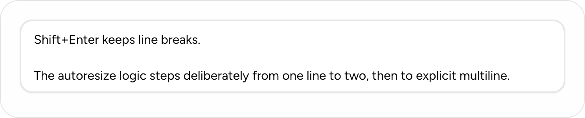
</p>
<p>
  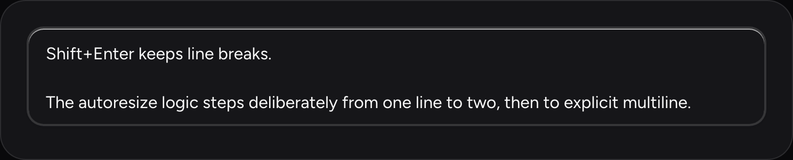
</p>

### ChatMessage

Implements: [`ChatMessage`](src/lib/components/ChatMessage.svelte)

Description: Single message renderer for user, assistant, and system turns, including attachments and ordered content parts.

Required inputs

- `message`
- `message.id`
- `message.role`
- `message.parts[]`

Optional inputs

- `message.attachments`
- `message.label`
- `customPart`

<p>
  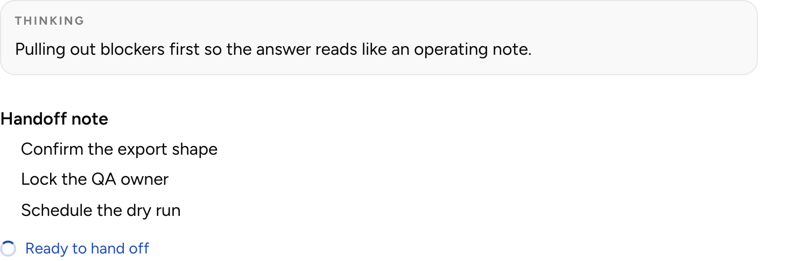
</p>
<p>
  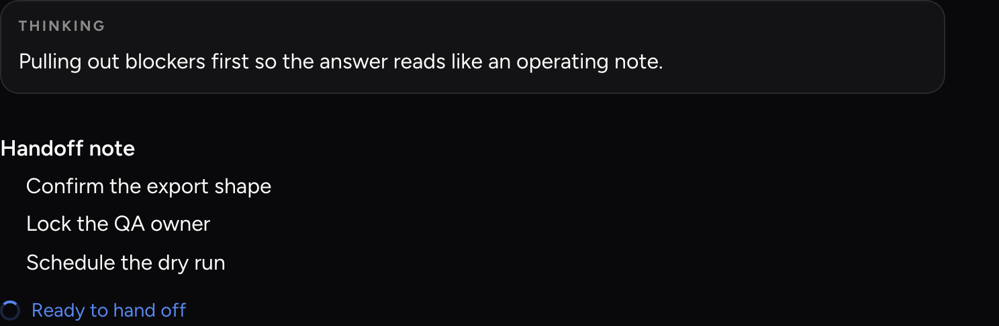
</p>

### ChatTaskCard

Implements: [`ChatTaskCard`](src/lib/components/ChatTaskCard.svelte)

Description: Presentational run-state card for long-running work, with progress, stats, warnings, timestamps, and follow-up actions.

Required inputs

- `task`
- `task.status`
- `task.title`

Optional inputs

- `task.accent`
- `task.actions`
- `task.eyebrow`
- `task.meta`
- `task.progress`
- `task.startedAt`
- `task.stats`
- `task.statusLabel`
- `task.subtitle`
- `task.summary`
- `task.warning`
- `class`

<p>
  
</p>
<p>
  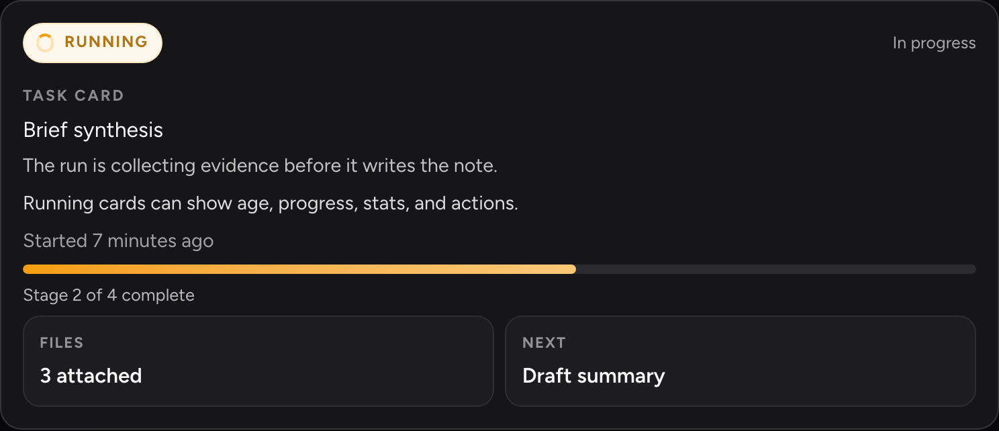
</p>

### ChatMarkdown

Implements: [`ChatMarkdown`](src/lib/components/ChatMarkdown.svelte)

Description: Shared markdown renderer with KaTeX maths, syntax-highlighted code blocks, inline mode, and copy buttons for fenced code.

Required inputs

- `markdown`

Optional inputs

- `inline`
- `class`

<p>
  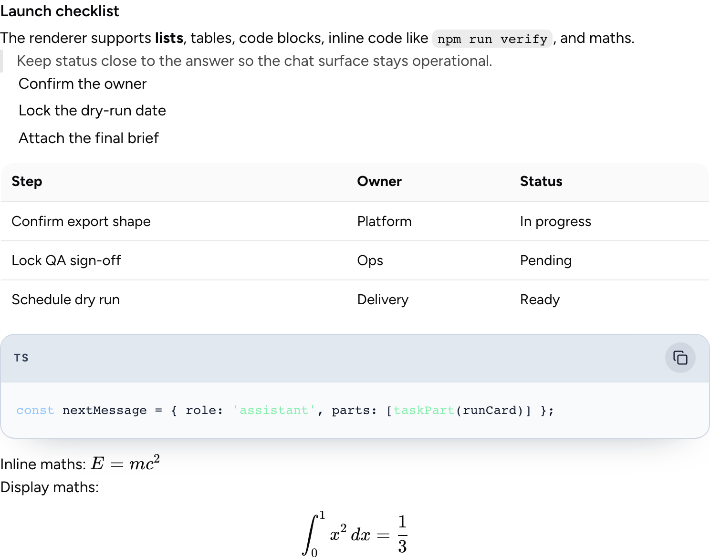
</p>
<p>
  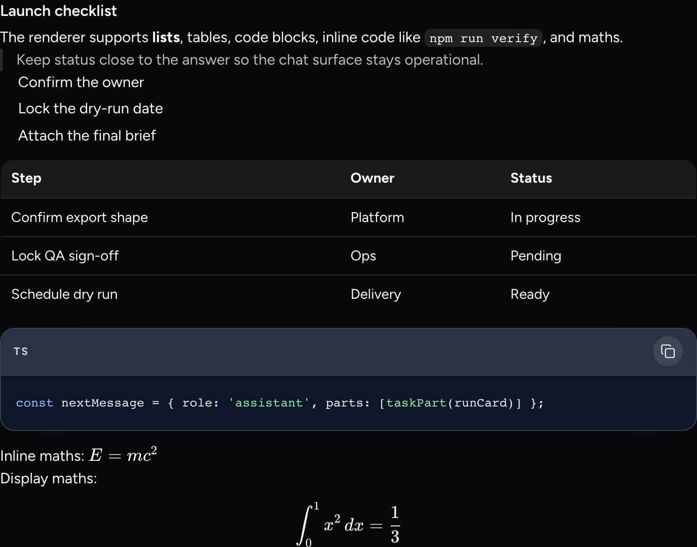
</p>

## Public API

```ts
import {
	ChatComposer,
	ChatInput,
	ChatMarkdown,
	ChatMessage,
	ChatTaskCard,
	ChatView,
	customPart,
	formatBytes,
	formatRelativeTime,
	markdownPart,
	renderChatMarkdown,
	renderChatMarkdownInline,
	statusPart,
	taskPart,
	textPart,
	thinkingPart,
	type ChatAttachment,
	type ChatAttachmentKind,
	type ChatAttachmentStatus,
	type ChatComposerAction,
	type ChatCustomPart,
	type ChatMarkdownPart,
	type ChatMessageData,
	type ChatMessagePart,
	type ChatPartStatusTone,
	type ChatRole,
	type ChatStatusPart,
	type ChatSuggestion,
	type ChatTaskCardAction,
	type ChatTaskCardData,
	type ChatTaskCardPart,
	type ChatTaskCardProgress,
	type ChatTaskCardStat,
	type ChatTaskStatus,
	type ChatTextPart,
	type ChatThinkingPart
} from '@ljoukov/chat';
```

## License

[MIT](./LICENSE)
